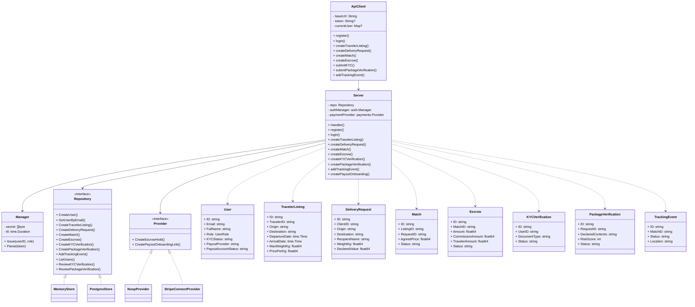
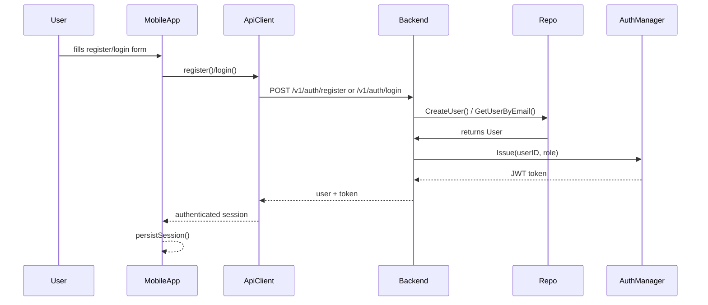
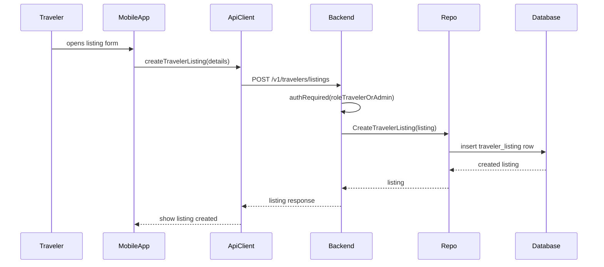
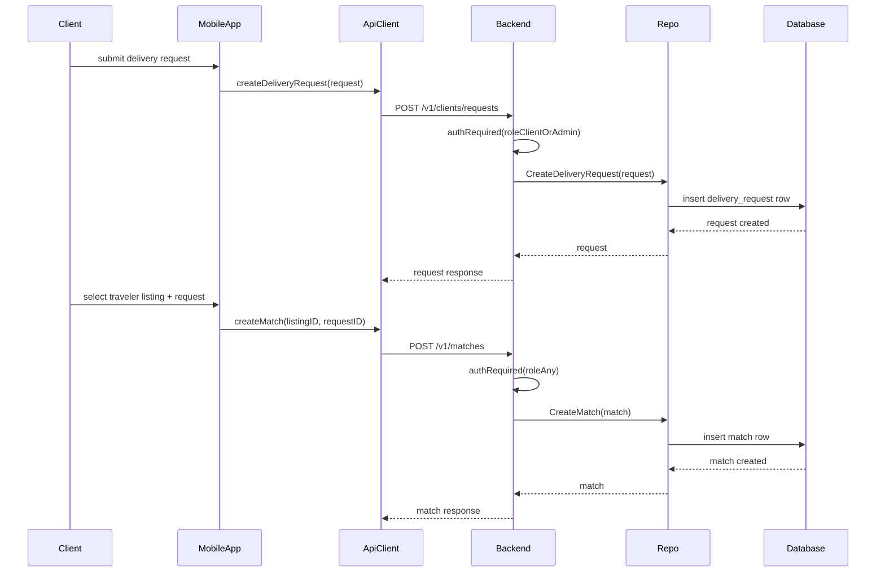
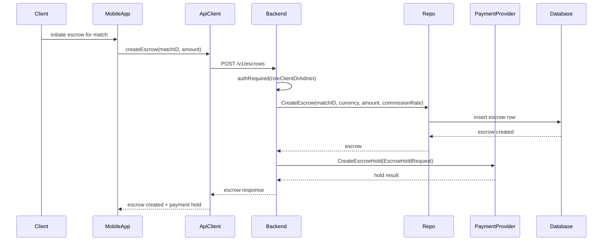
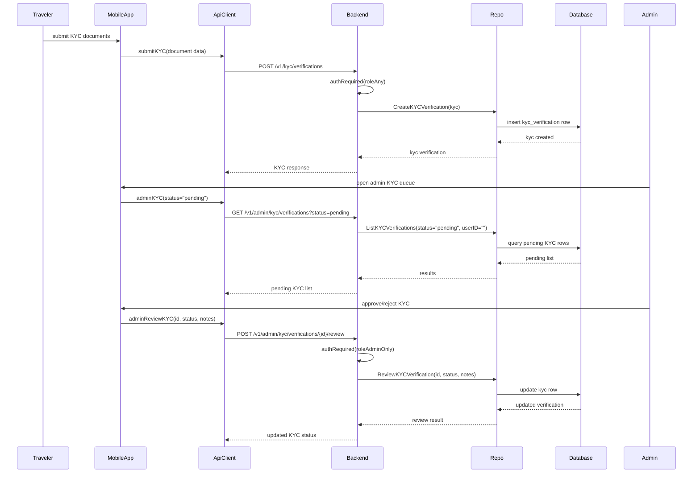

# Architecture Diagrams for Elyp2p

Ce document regroupe l’analyse de l’architecture backend/mobile du projet et génère 1 diagramme de cas d’utilisation, 1 diagramme de classes et 5 diagrammes de séquences.

## 1. Use Case Diagram

```mermaid
usecaseDiagram
  actor Client
  actor Traveler
  actor Admin
  actor "Mobile App" as MobileApp
  actor "Backend API" as Backend

  Client --> (Register / Login)
  Traveler --> (Register / Login)
  Admin --> (Register / Login)

  Client --> (Create Delivery Request)
  Traveler --> (Create Traveler Listing)
  Traveler --> (Submit KYC Verification)
  Client --> (Submit Package Verification)
  Traveler --> (Add Tracking Event)

  Client --> (Create Match)
  Client --> (Create Escrow)
  Client --> (Fund Escrow)
  Traveler --> (Release Escrow)

  Admin --> (Review KYC Verification)
  Admin --> (Review Package Verification)
  Admin --> (View Commission Summary)
  Admin --> (Manage Users)

  MobileApp --> Backend : HTTP REST API
  Backend --> (Register / Login)
  Backend --> (Create Traveler Listing)
  Backend --> (Create Delivery Request)
  Backend --> (Create Match)
  Backend --> (Create Escrow)
  Backend --> (Review Verifications)
  Backend --> (Tracking Events)
```

## 2. Class Diagram



## 3. Sequence Diagrams

### 3.1 User Registration and Login



### 3.2 Traveler Listing Creation



### 3.3 Delivery Request + Matching



### 3.4 Escrow Creation and Payment Hold



### 3.5 KYC Submission and Admin Review



## 4. Notes d’analyse

- `backend/internal/domain/models.go` contient les entités principales du domaine : `User`, `TravelerListing`, `DeliveryRequest`, `Match`, `Escrow`, `KYCVerification`, `PackageVerification`, `TrackingEvent`.
- `backend/internal/http/server.go` expose toutes les routes REST et orchestre l’authentification, les validations et les appels au dépôt (`store.Repository`).
- `backend/internal/store/repository.go` définit l’interface de persistance. Les implémentations actuelles sont en mémoire (`memory.go`) et Postgres (`postgres.go`).
- `backend/internal/auth/jwt.go` gère l’émission et la validation des tokens JWT.
- `mobile/lib/src/api/api_client.dart` contient le client API utilisé par l’application Flutter et simule un mode démo si l’API réelle n’est pas disponible.
- Le front Flutter sépare l’écran d’authentification (`AuthScreen`), le tableau de bord principal (`HomeScreen`), et des écrans métier comme les listes, KYC, vérifications de colis et admin.
- Les flux critiques sont : inscription/authentification, publication d’annonces/ demandes, appariement, escrows/payments, verifications KYC/colis, suivi des livraisons.

## 5. Fichiers clés

- `backend/internal/http/server.go`
- `backend/internal/domain/models.go`
- `backend/internal/store/repository.go`
- `backend/internal/auth/jwt.go`
- `mobile/lib/src/api/api_client.dart`
- `mobile/lib/src/app.dart`
- `mobile/lib/src/features/home/home_screen.dart`
